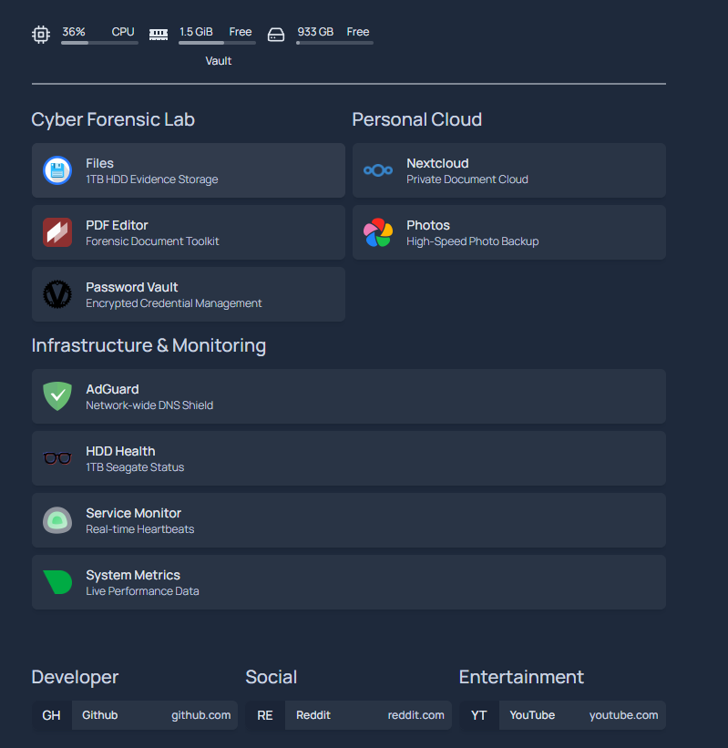

# 🛡️ Sentinel-Node: Cyber Forensic & Private Cloud Lab

[](https://www.docker.com/) 
[](https://github.com/pkvce2015/Sentinel-Node)
[](LICENSE)

A centralized, high-security home server architecture designed for **Digital Forensic research**, **Network Defense**, and **Personal Data Sovereignty**. This project serves as a practical implementation of digital investigation protocols and automated system monitoring.

---

## 🏗️ System Architecture
Sentinel-Node transforms a standard Intel i5/i7 hardware stack into a "Digital Vault" using a modular Docker-compose orchestration. 

### 🔍 Cyber Forensic Lab
* **FileBrowser**: Remote management and ingestion of evidence for the 1TB Seagate HDD array.
* **Stirling-PDF**: Privacy-first, locally-hosted PDF toolkit for forensic report sanitization and metadata management.
* **Vaultwarden**: Bitwarden-compatible server for encrypted investigation credential security.

### 🛡️ Network & Infrastructure
* **AdGuard Home**: Network-wide DNS sinkhole for malware blocking and forensic traffic analysis.
* **Scrutiny**: Low-level S.M.A.R.T. monitoring and thermal auditing of physical storage media (`/dev/sda`).
* **Netdata**: Real-time, per-second kernel-level performance monitoring.
* **Watchtower**: Automated container lifecycle management and security patching.

---

## 📸 Mission Control Dashboard
The **'Homepage'** dashboard provides a real-time "heartbeat" of all forensic services, hardware thermals, and storage health.



---

## 📂 Project Structure
```text
Sentinel-Node/
├── README.md                    # Project Documentation
├── docker-compose-master.yml    # Master Deployment Template (Sanitized)
├── .gitignore                   # Forensic Safety Filters
└── services/                    # Modular Service Configuration
    ├── adguard/                 # DNS Security & Filtering Rules
    ├── vaultwarden/             # Encrypted Vault Configuration
    ├── scrutiny/                # HDD S.M.A.R.T. Metrics
    └── homepage/                # Dashboard Layout & Icons
